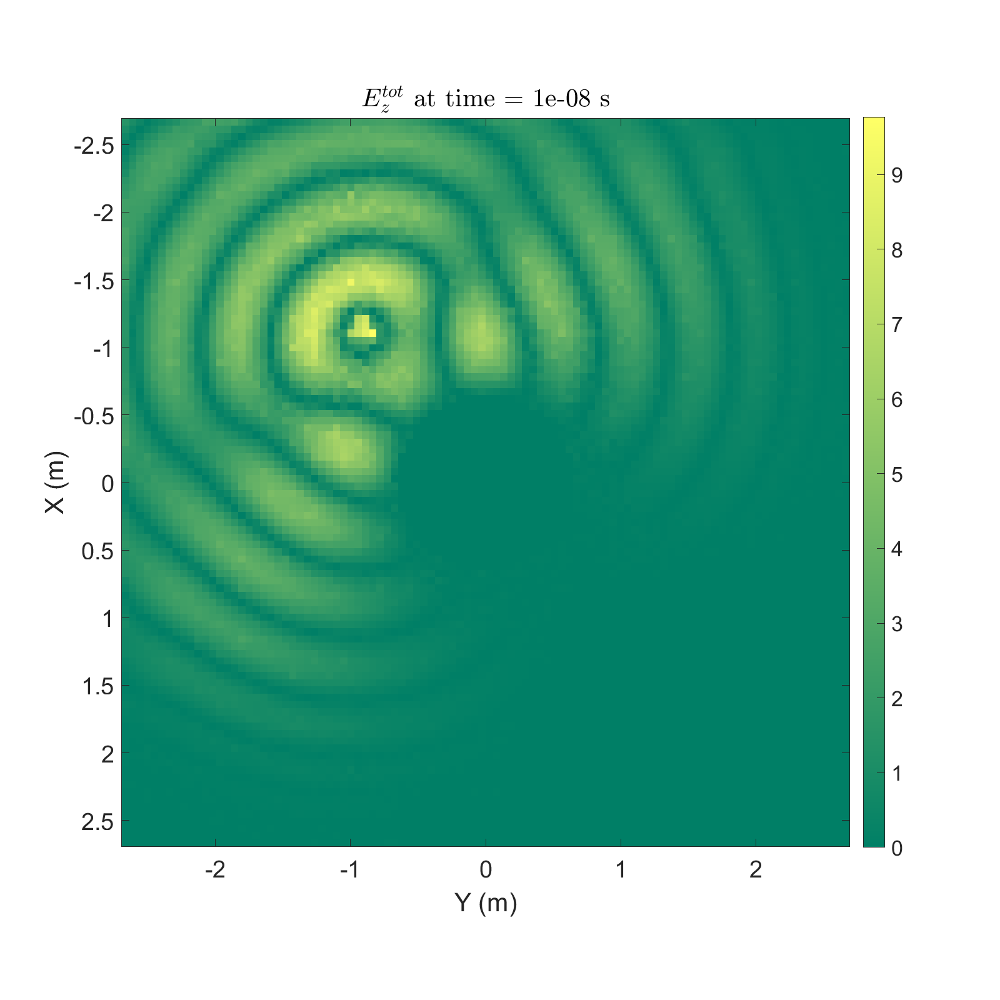
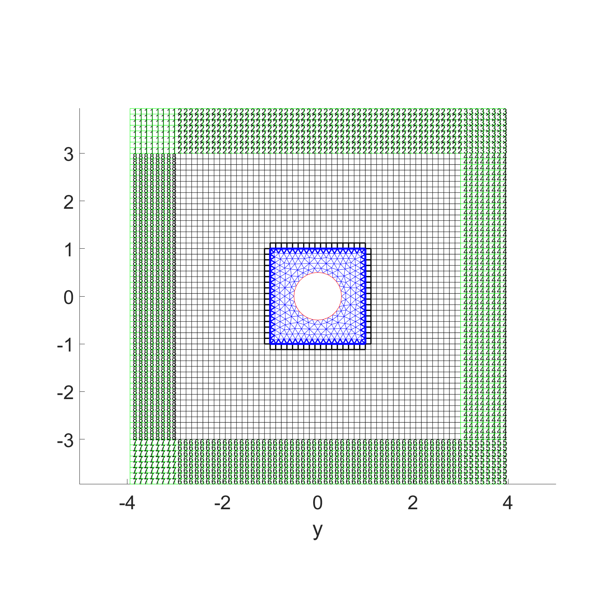
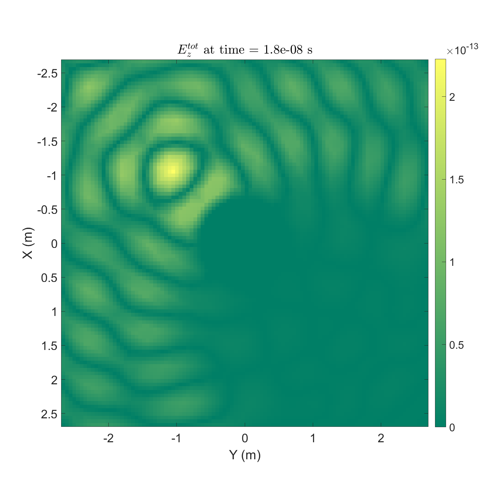

# Numerical-Algorithms-in-Time-Domain-PDE-Maxwell-Equations-
The CEM community is famous by its lack of open-source ethos and most source codes are kept in secret due to historical, commericial and political reasons.

This repository contains 7 Matlab scripts that elaborate the classical and fancy numerical algorithms for simulating Maxwell Equations in 2D. Three of the scripts (scalarFEMABC.m, scalarFEMPML.m, vectorFEMABC.m) are for frequency domain simulation and the others (2D_FDTD_PML.m, scalarFETD.m, hybrid_FETD_FDTD.m, scalarDGTD.m) are for time domain simulation. All scripts are extremely user friendly in that all components such as preprocessing, PDE computation, posprocessing, and etc have no dependency on other softwares and libraries. The user can simply run the codes and visualize the results with a single click.

## Frequency Domain FEM with scalar basis and ABC
scalarFEMABC.m
## Frequency Domain FEM with vector basis and ABC
vectorFEMABC.m
## Frequency Domain FEM with PML
scalarFEMPML.m

## FDTD
2D_FDTD_PML.m

## FETD 
scalarFETD.m

## hybrid FDTD-FETD
hybrid_FETD_FDTD.m

## DGTD
scalarDGTD.m

